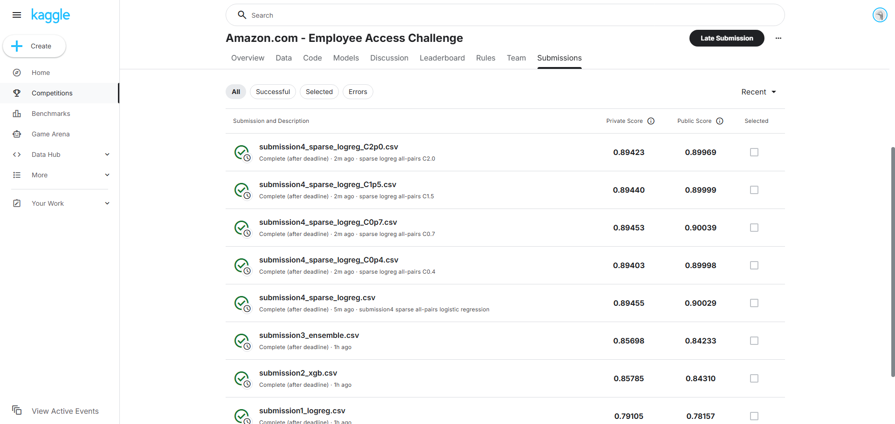

# HW3 Report Draft - Amazon Employee Access Challenge

## 1. 題目與目標

本作業使用 Kaggle Amazon Employee Access Challenge。目標是根據員工角色與資源相關欄位，預測該筆存取申請是否應被核准，目標欄位為 `ACTION`，評估指標為 AUC。

## 2. 資料前處理與特徵分析

資料欄位包含 `RESOURCE`、`MGR_ID`、`ROLE_ROLLUP_1`、`ROLE_ROLLUP_2`、`ROLE_DEPTNAME`、`ROLE_TITLE`、`ROLE_FAMILY_DESC`、`ROLE_FAMILY`、`ROLE_CODE`。這些欄位雖然以整數 ID 表示，但大小沒有連續數值意義，因此全部視為類別型特徵處理。

前處理方式：

- 保留原始類別 ID，不使用 one-hot encoding 作為主方法，避免高維稀疏矩陣。
- 使用 target encoding，將每個類別轉換為訓練資料中平滑後的平均核准率。
- 使用 count encoding，將每個類別轉換為出現頻率，並在模型輸入前做 `log1p`。
- 新增組合特徵，例如 `RESOURCE_MGR_ID`、`RESOURCE_ROLE_CODE`、`MGR_ID_ROLE_CODE`、`ROLE_DEPTNAME_ROLE_TITLE`、`ROLE_FAMILY_ROLE_CODE`，捕捉資源與角色/主管之間的互動。
- Cross-validation 時，每個 fold 只用該 fold 的訓練資料 fit encoding，再套用到 validation fold，以降低 target leakage。

## 3. 模型訓練流程

### Submission 1: Logistic Regression Baseline

程式：`scripts/run_baseline.py`

模型設定：

- `LogisticRegression`
- `C=0.1`
- `max_iter=1000`
- `class_weight="balanced"`
- 特徵：target encoding + count encoding + pairwise combination features

目的：建立第一個可解釋且穩定的 baseline，作為後續模型改進比較基準。

### Submission 2: XGBoost

程式：`scripts/run_improved.py`

模型設定：

- `XGBClassifier`
- `objective="binary:logistic"`
- `eval_metric="auc"`
- `n_estimators=350`
- `learning_rate=0.05`
- `max_depth=5`
- `min_child_weight=2`
- `subsample=0.85`
- `colsample_bytree=0.85`
- `reg_alpha=0.05`
- `reg_lambda=1.0`

目的：使用 gradient boosting 擷取非線性關係，通常比線性模型更適合類別編碼後的交互特徵。

### Submission 3: LightGBM + XGBoost Ensemble

程式：`scripts/run_ensemble.py`

模型設定：

- LightGBM 使用與第二輪實驗相近的 boosting 參數。
- XGBoost 使用 `objective="binary:logistic"`、`eval_metric="auc"`、`n_estimators=350`、`learning_rate=0.05`、`max_depth=5`。
- 最終預測以 `0.6 * LightGBM + 0.4 * XGBoost` blending。

目的：結合兩個 boosting model 的不同偏誤，降低單一模型在 public/private split 上的波動。

### Submission 4: Sparse All-Pairs Logistic Regression

程式：`scripts/run_sparse_logreg.py`

模型設定：

- `OneHotEncoder(handle_unknown="ignore")`
- 原始 9 個類別欄位
- 所有兩兩類別組合，共 36 個 pairwise interaction features
- `LogisticRegression`
- `C=1.0`
- `solver="liblinear"`
- `max_iter=1500`

目的：此資料集所有特徵都是類別 ID，ID 大小沒有數值意義。相較 target/count encoding，one-hot encoding 可以保留精確類別身份，而所有 pairwise interactions 可以直接表示「某資源 + 某主管」、「某資源 + 某職位」等存取規則。雖然維度很高，但使用 sparse matrix 後實際儲存與訓練仍可接受。

## 4. Submission 紀錄表

| Version | File | Main Change | CV AUC | Public Score | Private Score | Screenshot |
| --- | --- | --- | --- | --- | --- | --- |
| 1 | `submission1_logreg.csv` | Logistic Regression baseline | 0.78901 +/- 0.01392 | 0.78157 | 0.79105 | `docs/screenshots/kaggle_submissions_with_sparse_logreg.png` |
| 2 | `submission2_xgb.csv` | XGBoost nonlinear model | 0.81902 | 0.84310 | 0.85785 | `docs/screenshots/kaggle_submissions_with_sparse_logreg.png` |
| 3 | `submission3_ensemble.csv` | LightGBM + XGBoost blending | 0.81928 | 0.84233 | 0.85698 | `docs/screenshots/kaggle_submissions_with_sparse_logreg.png` |
| 4 | `submission4_sparse_logreg.csv` | Sparse all-pairs Logistic Regression | 0.87908 +/- 0.01208 | 0.90029 | 0.89455 | `docs/screenshots/kaggle_submissions_with_sparse_logreg.png` |

## 5. 改進流程與原因

第一次 submission 使用 Logistic Regression 作為 baseline。此模型簡單、訓練快速，可用來確認資料讀取、encoding 與 submission 格式正確。

第二次 submission 改用 XGBoost。原因是本資料集的類別特徵與組合特徵可能存在非線性互動，樹模型較能捕捉這類規則。實驗中 LightGBM 參數需要更細緻調整才穩定提升，而 XGBoost 在 cross-validation 上提供較明顯的 AUC 改善，因此選為正式第二版。

第三次 submission 將 XGBoost 與 LightGBM 加權平均。原因是兩個 boosting 實作的分裂策略與正則化方式不同，錯誤型態不完全相同，ensemble 往往能讓預測更穩定。

前三次本機 5-fold cross-validation 的趨勢為 `0.78901 -> 0.81902 -> 0.81928`，顯示從線性模型改為 boosting 後有明顯提升。Kaggle public/private score 則為 `0.78157/0.79105 -> 0.84310/0.85785 -> 0.84233/0.85698`。第三版 ensemble 雖然 CV 稍高，但 Kaggle 分數略低，可能原因是 LightGBM 子模型在此資料切分上泛化較弱，混合後稀釋了 XGBoost 的預測品質。

第四次 submission 改用 sparse one-hot 加上所有 pairwise interaction features。這次本機 CV AUC 為 `0.87908 +/- 0.01208`，Kaggle public/private score 達到 `0.90029/0.89455`，是所有 submission 中最高。這代表此資料集的關鍵訊號較像是特定類別組合規則，而不是連續數值關係；線性模型搭配高維稀疏交互特徵能更精準地表示這些規則。

第四版也針對 Logistic Regression 的正則化強度 `C` 做小範圍測試：`C=0.4` 得到 public/private `0.89998/0.89403`，`C=0.7` 得到 `0.90039/0.89453`，`C=1.5` 得到 `0.89999/0.89440`，`C=2.0` 得到 `0.89969/0.89423`。雖然 `C=0.7` 的 public score 最高，但 `C=1.0` 的 private score 最高，因此保留 `C=1.0` 作為最終版本。

## 6. Public / Private Score 分析填寫提示

本次 public score 與 private score 的整體趨勢大致一致：原始編碼後的 Logistic Regression 明顯低於 boosting 方法，而 sparse all-pairs Logistic Regression 又明顯高於 boosting 方法。第四版 public score 為 `0.90029`、private score 為 `0.89455`，為所有 submission 中最高。

第三版 ensemble 的 public/private score 分別為 `0.84233` 與 `0.85698`，略低於第二版。雖然 ensemble 的本機 CV AUC 比 XGBoost 單模型高 `0.00026`，但 leaderboard 較低，代表 CV 上的小幅提升不一定能穩定轉移到 Kaggle split。可能原因是 LightGBM 子模型的預測品質較弱，加入後降低了 XGBoost 原本較準確的排序結果。後續若要改善，可調高 XGBoost 權重，例如使用 `0.8 * XGBoost + 0.2 * LightGBM`，或直接以 XGBoost 作為最終模型。

## 7. 截圖紀錄

Kaggle submission 與調參結果截圖紀錄如下：

## 8. 繳交內容

最終繳交 ZIP 建議包含：

- 書面報告 PDF
- `src/`
- `scripts/`
- `tests/`
- `requirements.txt`
- `README.md`

不要把 `data/raw/`、`data/processed/`、`submissions/` 放入版本控制；如果老師要求附 submission CSV，可另外放入 ZIP 的 `submissions/`。
